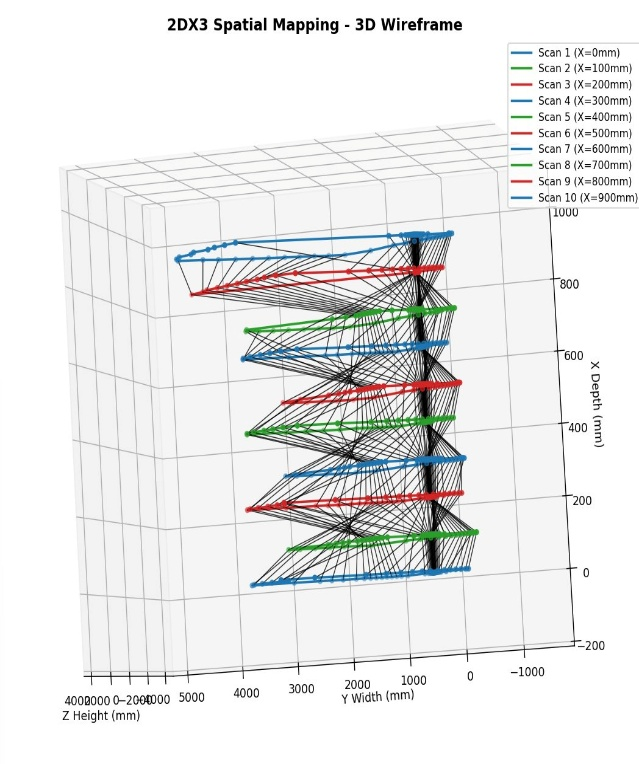
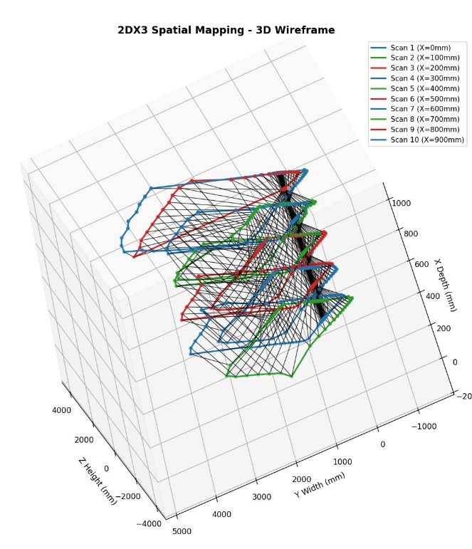
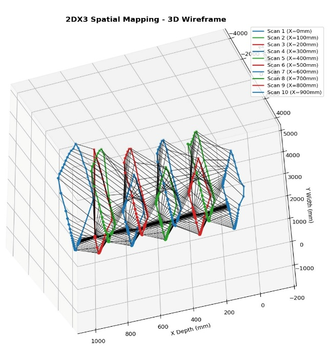

# Indoor LIDAR Spatial Mapping System

**COMPENG 2DX3 Final Project | McMaster University | Winter 2026**

A full-stack 3D spatial mapping system built on an ARM Cortex-M4F microcontroller. A VL53L1X Time-of-Flight sensor mounted on a stepper motor performs 360-degree sweeps of an indoor environment. Measurements stream over UART to a Python script that converts polar coordinates to Cartesian and renders an interactive 3D wireframe.

---

## Demo

> Scan location: Section G, 2nd floor, Engineering Technology Building (ETB), McMaster University

**Isometric View**


**Front View**


**Side View**


---

## System Overview

```
┌─────────────────────────────────────────────────────────────┐
│                        PC (Python)                          │
│   PySerial → parse UART → polar-to-Cartesian → Matplotlib  │
└────────────────────────┬────────────────────────────────────┘
                         │ UART 115200 bps (Micro-USB / XDS110)
┌────────────────────────▼────────────────────────────────────┐
│              MSP-EXP432E401Y (ARM Cortex-M4F)               │
│   28 MHz clock │ GPIO interrupts │ SysTick │ UART │ I2C     │
│                                                             │
│   PJ0/PJ1 ──► Start / Pause buttons                        │
│   PH0–PH3 ──► ULN2003 ──► 28BYJ-48 stepper motor          │
│   PB2/PB3 ──► I2C0 (SCL/SDA) ──► VL53L1X ToF sensor       │
│   PG0     ──► XSHUT (hardware reset)                       │
│   PN0/PF0/PF4 ──► Status LEDs                              │
└─────────────────────────────────────────────────────────────┘
```

---

## Hardware

| Component | Role | Price |
|---|---|---|
| MSP-EXP432E401Y LaunchPad | Main microcontroller (ARM Cortex-M4F, 120 MHz) | $47.99 |
| Pololu VL53L1X ToF Sensor | Distance measurement via 940 nm IR laser (up to 4 m) | $18.95 |
| 28BYJ-48 Stepper Motor | 360° rotation platform for the sensor | $11.73 |
| ULN2003 Darlington Driver | Drives the 4-phase stepper from GPIO logic | $1.35 |
| **Total** | | **$80.02** |

---

## Firmware (Keil MDK / C)

### Key source files

| File | Description |
|---|---|
| `2dx_studio_8.c` | Main application: scan loop, motor control, UART output, interrupt handlers |
| `VL53L1X_api.c/.h` | ST VL53L1X ULD driver for I2C ranging |
| `vl53l1_platform_2dx4.c/.h` | Platform I2C read/write implementation for MSP432 |
| `uart.c/.h` | UART0 driver at 115200 bps |
| `PLL.c/.h` | PLL configuration (28 MHz, PSYSDIV = 16) |
| `SysTick.c/.h` | SysTick-based delay functions |
| `onboardLEDs.c/.h` | LED GPIO helpers |

### Scan parameters

| Parameter | Value |
|---|---|
| System clock | 28 MHz (PSYSDIV = 16) |
| Points per scan | 64 (5.625° angular resolution) |
| Motor steps per point | 32 full steps |
| Total steps per revolution | 2048 |
| Number of scans | 3 (configurable via `NUM_SCANS`) |
| X-axis offset between scans | 100 mm |
| ToF timing budget | 50 ms |
| Inter-measurement period | 60 ms |
| UART baud rate | 115200 bps (8N1) |
| I2C speed | 100 kbps (standard mode) |
| Distance mode | Long-range (up to 4 m) |

### Pin assignments

| Pin | Function |
|---|---|
| PH0–PH3 | Stepper motor coil drive (4-phase via ULN2003) |
| PJ0 | SW1: Start scan (falling-edge interrupt) |
| PJ1 | SW2: Pause / Resume (falling-edge interrupt) |
| PB2 / PB3 | I2C0 SCL / SDA to VL53L1X |
| PG0 | XSHUT (hardware reset of ToF sensor) |
| PN0 (D2) | Measurement LED: flashes per distance reading |
| PF0 (D4) | UART TX LED: flashes per serial transmission |
| PF4 (D3) | Ready/Idle LED: ON when waiting, OFF during scan |
| Micro-USB | UART to PC via XDS110 bridge |

### How a scan works

1. User presses PJ0 (SW1) to trigger a falling-edge interrupt, setting `startRequest = 1`
2. Main loop calls `runOneScan()` for the current scan index
3. For each of 64 points: motor advances 32 steps via `spinOnePoint()`, then the firmware polls `VL53L1X_CheckForDataReady()` and reads distance via `VL53L1X_GetDistance()`
4. Each reading is formatted and sent over UART: `Point N, Offset: X mm, Angle: A mdeg, Distance: D mm`
5. Motor direction alternates CW/CCW each scan to prevent cable wrap
6. After all scans, `sendAllData()` retransmits the full dataset bracketed by `START` / `END`

---

## Python Visualization (`ScanCode.py`)

### Dependencies

```bash
pip install pyserial matplotlib
```

### Configuration

Open `Python_Graphing/ScanCode.py` and set your COM port:

```python
SERIAL_PORT = "COM6"   # Windows: check Device Manager for XDS110 port
BAUD_RATE   = 115200
```

On macOS/Linux use something like `/dev/ttyACM0` or `/dev/tty.usbmodem...`

### Running

```bash
python ScanCode.py
```

The script listens on the serial port and waits for the board to transmit. Press PJ0 to kick off each scan. After the final scan the board retransmits all data, the script saves output files, and the 3D wireframe renders automatically.

### Output files

| File | Contents |
|---|---|
| `scan_points.xyz` | Space-separated X Y Z coordinates (one point per line) |
| `scan_points.csv` | Scan number, x_mm, angle_deg, distance_mm, X, Y, Z |
| `scan_3d.png` | Rendered 3D wireframe (150 DPI) |

### Coordinate system

```
X-axis  Depth between scan planes (100 mm spacing)
Y-axis  y = d × cos(θ)  — horizontal width in scan plane
Z-axis  z = d × sin(θ)  — vertical height in scan plane
```

---

## Repo Structure

```
lidar-spatial-mapping-2dx3/
│
├── firmware/                        # Keil MDK project
│   ├── 2dx_studio_8.c               # Main application source
│   ├── 2dx_studio_8.uvprojx         # Keil project file
│   ├── PLL.c / PLL.h
│   ├── SysTick.c / SysTick.h
│   ├── uart.c / uart.h
│   ├── onboardLEDs.c / onboardLEDs.h
│   ├── VL53L1X_api.c / VL53L1X_api.h
│   ├── vl53l1_platform.c / .h
│   ├── vl53l1_platform_2dx4.c / .h
│   ├── vl53l1_types.h / vl53l1_types_2dx4.h
│   ├── tm4c1294ncpdt.h
│   ├── EventRecorderStub.scvd
│   ├── Listings/                    # Linker map and assembler listings
│   ├── Objects/                     # Compiled object files and final binary
│   ├── RTE/                         # Keil RTE device support files
│   └── docs/                        # VL53L1X datasheets
│
├── visualization/                   # PC-side Python script
│   └── ScanCode.py
│
└── README.md
```

---

## Setup and Flashing

### Hardware wiring

1. Mount the VL53L1X on the stepper motor shaft using a 3D-printed bracket, sensor facing outward
2. Connect the ULN2003 driver to Port H: PH0 IN1, PH1 IN2, PH2 IN3, PH3 IN4. Supply +5V from the LaunchPad
3. Connect the VL53L1X: VIN to 3.3V, GND to GND, SDA to PB3, SCL to PB2, XSHUT to PG0
4. Connect the MSP432 to your PC via Micro-USB

### Flashing firmware

1. Open `firmware/2dx_studio_8.uvprojx` in Keil MDK
2. Set target to MSP432E401Y, click Translate then Build then Download
3. Press Reset on the board after flashing. All LEDs should flash briefly confirming boot

### Running a scan session

1. Run `python visualization/ScanCode.py` on the PC first (it starts listening)
2. Press PJ0 (SW1) on the board to start scan 1. The PF4 ready LED turns off during scanning
3. Press PJ0 again for each subsequent scan (motor alternates direction each time)
4. Use PJ1 (SW2) anytime to pause or resume the motor mid-scan
5. After the final scan the board retransmits all data and Python renders the 3D plot

---

## Known Limitations

- **Motor speed is the bottleneck:** 32 steps x 20 ms/step = 640 ms per point, 41 seconds per full 360-degree scan. Sensor ranging (3.8 s total) and I2C overhead (32 ms) are negligible by comparison
- **ToF quantization:** Long-range mode returns whole-millimetre integers. Worst-case quantization error is 0.5 mm; datasheet accuracy is ±25 mm under typical indoor conditions
- **Single-precision FPU:** The Cortex-M4F FPU only handles 32-bit IEEE 754 floats. Trigonometric functions fall back to software approximations (error ~10^-6). All trig in this project is done in Python (64-bit double) to avoid this
- **28BYJ-48 step accuracy:** Non-accumulative step error of ±5% per the datasheet
- **VL53L1X FOV:** 27-degree field of view limits detection of objects at shallow angles. Highly reflective or absorbing surfaces at 940 nm may produce inaccurate readings
- **Cable wrap:** Alternating CW/CCW rotation between scans prevents tangling but limits continuous rotation configurations

---

## References

- [VL53L1X Datasheet](https://www.pololu.com/file/0J1506/vl53l1x.pdf)
- [MSP-EXP432E401Y User's Guide (SLAU748B)](https://www.ti.com/lit/ug/slau748b/slau748b.pdf)
- [28BYJ-48 Stepper Motor Datasheet](https://www.mouser.com/datasheet/2/758/stepd-01-data-sheet-1143075.pdf)
- [ULN2003A Datasheet](https://www.electronicoscaldas.com/datasheet/ULN2003A-PCB.pdf)
- [PySerial Docs](https://pyserial.readthedocs.io/)
- [Matplotlib 3D Plotting](https://matplotlib.org/stable/gallery/mplot3d/)
